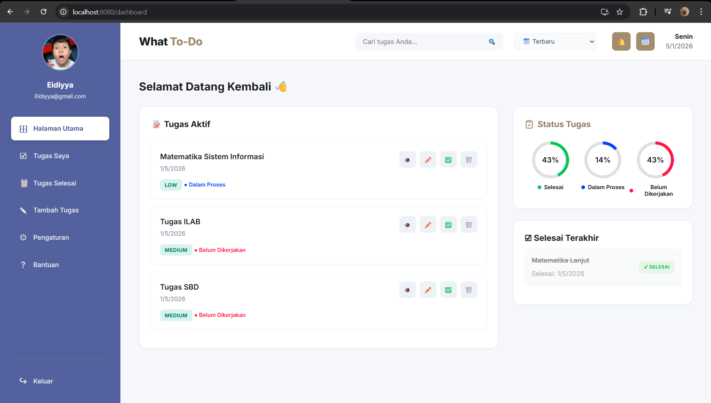

```markdown```
# 📝 What To-Do App

**What To-Do** adalah aplikasi manajemen tugas (To-Do List) modern berbasis web yang dirancang untuk produktivitas maksimal. Aplikasi ini dikembangkan sebagai **Progressive Web App (PWA)**, sehingga dapat diinstal dan berjalan secara offline.



## 🚀 Fitur Utama

### 🌟 Produktivitas & Manajemen
- **CRUD Tugas Lengkap:** Tambah, Edit, Hapus, dan Tandai Selesai tugas dengan mudah.
- **Kalender Interaktif:** Visualisasi tenggat waktu (deadline) tugas dalam tampilan bulanan.
- **Dashboard Statistik:** Pantau progres (Todo, Process, Done) dengan grafik donat yang dinamis.
- **Pencarian & Penyortiran:** Filter tugas berdasarkan kata kunci, prioritas, atau tanggal.

### 🔔 Notifikasi Cerdas
- **Pengingat Harian (Auto):** Notifikasi otomatis muncul saat membuka aplikasi jika ada deadline hari ini.
- **Cek Manual:** Tombol lonceng di header untuk mengecek tugas hari ini kapan saja.

### ⚡ Teknologi PWA & Data
- **Offline Mode:** Aplikasi tetap bisa dibuka dan berjalan tanpa koneksi internet (Service Worker).
- **Manajemen Data:** Fitur **Export** (Backup) dan **Import** (Restore) data tugas dalam format JSON.
- **Penyimpanan Lokal:** Menggunakan **IndexedDB** untuk performa database yang cepat dan kapasitas besar.

### 🎨 Tampilan (UI/UX)
- **Dark Mode:** Tema gelap yang nyaman di mata (tersedia tombol switch di pengaturan).
- **Responsive Design:** Tampilan optimal di Laptop, Tablet, maupun HP.

## 🛠️ Teknologi yang Digunakan

- **Frontend:** HTML5, CSS3 (Custom Variables), Vanilla JavaScript (ES6+).
- **Build Tool:** Webpack 5.
- **Database:** IndexedDB (via library `idb`).
- **PWA:** Workbox & Service Worker API.

## 📂 Struktur Proyek

```text
my-todo-app/
├── public/                 # Aset Publik (Diakses langsung)
│   ├── images/             # Folder Gambar (Icon, Screenshot, Ilustrasi)
│   ├── manifest.json       # Konfigurasi PWA
│   └── service-worker.js   # Script Service Worker
├── src/                    # Source Code Utama
│   ├── js/
│   │   ├── views/          # Tampilan per Halaman (Dashboard, Login, dll)
│   │   ├── app.js          # Logika Navigasi Global
│   │   ├── db.js           # Database Helper (IndexedDB)
│   │   ├── layout.js       # Komponen Layout (Sidebar/Header)
│   │   ├── main.js         # Pendaftaran PWA
│   │   └── routes.js       # Routing Halaman
│   ├── styles/             # File CSS
│   └── index.html          # File HTML Utama
├── dist/                   # Hasil Build (Production)
├── package.json            # Daftar Dependencies
└── webpack.config.js       # Konfigurasi Webpack

```

## 💻 Cara Menjalankan (Local Development)

Pastikan **Node.js** sudah terinstal di komputer Anda.

1. **Clone Repository (atau download folder):**
```bash
git clone [https://github.com/username-anda/what-todo-app.git](https://github.com/farreldrifqi/what-todo-app.git)
cd what-todo-app

```


2. **Install Dependencies:**
```bash
npm install

```


3. **Jalankan Mode Development:**
```bash
npm run start

```


Buka browser dan akses: `http://localhost:8080`

## 📦 Cara Build (Production)

Untuk menghasilkan folder siap upload ke hosting (seperti Vercel/Netlify):

```bash
npm run build

```

File hasil build akan muncul di folder `dist/`.

## 🤝 Kontribusi

Proyek ini dibuat untuk tujuan pembelajaran implementasi PWA dan Modern JavaScript. Kritik dan saran sangat diterima!

---

**Dibuat dengan senyuman :)**